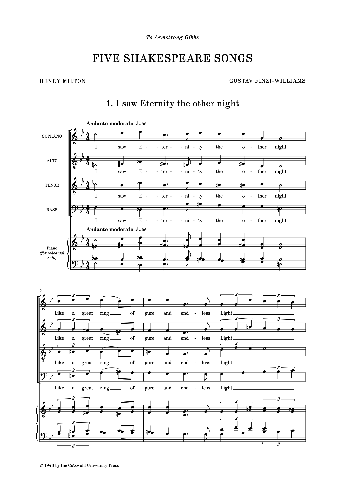

# Nepomuk font family

This font family is inspired by the type commonly found in music plate engraving from the late 19th to the mid 20th-century.

Based on characters designed by Florian Kretlow, the family has been expanded by Ben Byram-Wigfield. Bold and Bold Italic weights have been created; kerning and tracking has been improved, and a greater range of characters added. Glyphs have been revised throughout. Additions includes more diacritics and non-Roman characters (for all your Czech, Hungarian, Polish and Icelandic composers), and punctuation, including non-breaking hyphens. There are also extra characters of use in music, such as Unicode music accidentals, and versicle and response symbols.

The text is deliberately 'quite tight', so that it can be used for lyrics without overly distorting note spacing; users may want to apply letter spacing (tracking) for titling and other page furniture. 

The accidentals can be accessed using the ligatures $b, $n, and $s, or directly using their Unicode values U+266D - U+266F).

v2.01: More improvements to kerning; Small Caps have been added to Regular and Bold styles.  
v2.02: More kerning revisions! Also Unicode Roman Numerals to Regular and Italic styles.  
v2.08: Fix to grave accent in Bold Italic; addition of vowel carons.  
v2.07: Fixes to Windows naming; addition of most European diacritics and other characters.  
v2.50: Bold and Bold Italic styles have been substantially revised, with more kerning improvements all around.  
v2.51: Snagging from 2.50; kerning and fixes to punctation (brackets, quotes).
v2.60: Addition of Tabular numerals.

The SC and Bold SC variants are considered 'legacy', and only for use in applications that do not support OpenType Small Caps features.

A small range of sample pages, such as this one below, can be found in the images folder.

The fonts in this archive are free to use for everybody. They're licensed under the [SIL Open Font License](http://scripts.sil.org/ofl).

Derivative versions must use a different name.