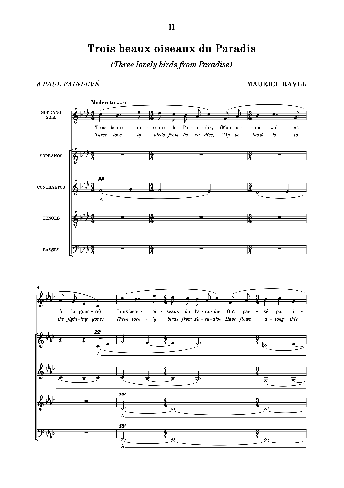

# Nepomuk font family

This font family is inspired by the 'punch' text commonly found in music plate engraving in the 20th-century. 

Based on characters designed by Florian Kretlow, the family has been expanded with Bold and Bold Italic weights. Kerning and tracking has been improved, and a greater range of characters added. This includes diacritics and non-Roman characters (for all your Czech and Icelandic composers), punctuation including non-breaking hyphens, and Unicode musical accidentals.

The accidentals can be accessed using the ligatures $b, $n, and $s, or directly using their Unicode values U+266D - U+266F).

A small range of sample pages, such as this one below, can be found in the images folder.

The fonts in this archive are free to use for everybody. They're licensed under the [SIL Open Font License](http://scripts.sil.org/ofl).
